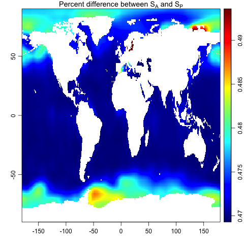

**Abstract.** The `gsw` package provides an R implementation of the Gibbs
SeaWater toolbox for the calculation of seawater properties, based on the GSW-C
framework^[This version of GSW-R is based on GSW-C as it existed on 2021-07-06
in github commit 9c10670e89fce906da2cebce3399d73c054e769e; see
<https://github.com/TEOS-10/GSW-C>.].  This vignette outlines how to use `gsw`
alone or as part of the `oce` package [@kelley_oce_2021].

# Introduction

In recent years, thermodynamic considerations have led to improved formulae for
the calculation of seawater properties
[@ioc_international_2010;@millero_history_2010;@pawlowicz_preface_2012], an
important component of which is the Gibbs-SeaWater (GSW) toolbox
[@mcdougall_getting_2020].  The `gsw` package is an R version of GSW, which may
be used independently or within the more general `oce` package
[@kelley_oce_2021].

This vignette sketches how to use `gsw`.  Readers are assumed to be familiar
with oceanographic processing, and at least somewhat familiar with GSW.  A good
resource for learning more about GSW is
[http://www.teos-10.org](http://www.teos-10.org), which provides technical
manuals for the Matlab version of GSW
[http://www.teos-10.org/pubs/gsw/html/gsw_contents.html](http://www.teos-10.org/pubs/gsw/html/gsw_contents.html),
along with white papers and links to the growing peer-reviewed literature on the
topic.

The `gsw` framework uses function wrappers that connect R with the C version of
the Gibbs Seawater library. This yields high processing speed.  By minimizing
transliteration errors, it also increases reliability.  In a further effort to
increase reliability, GSW-R makes tests against the check values provided on
the webpages that document GSW-Matlab.

By design, the documentation of `gsw` functions is spare, amounting mainly to an
explanation of function arguments and return values, with most other details
being provided through hyperlinks to the GSW reference documentation. The idea
is to avoid duplication and to encourage users to consult the technical
materials linked to the GSW functions mimicked in `gsw`.  The GSW system is
somewhat complex, and analysts owe it to themselves to learn how it works, and
also to develop an appreciation for its scientific context by consulting
various documents at [http://www.teos-10.org](http://www.teos-10.org),
including expansive white papers and pointers to the growing peer-reviewed
literature
[@wright_absolute_2011;@mcdougall_getting_2020;@graham_quantifying_2012].

# Using gsw independent of oce

```{r echo=FALSE, results="hide"}
options(keep.source=TRUE, width=60, prompt=' ', continue=' ', oceEOS="unesco")
```

Suppose a water sample taken at pressure (For practical reasons, `gsw` goes
beyond SI to incorporate oceanographic units, such as decibars for pressure.)
100 dbar, longitude 188E and latitude 4N, reveals Practical Salinity 35 and
in-situ temperature 10$^\circ$C (ITS-90).  Then the Absolute Salinity may be
calculated as follows.

```{r}
library(gsw)
SA <- gsw_SA_from_SP(SP=35, p=100, longitude=188, latitude=4)
```

This yields
`SA`=`r SA` [g/kg], which can then be used to
calculate Conservative Temperature as follows.

```{r}
CT <- gsw_CT_from_t(SA=SA, t=10, p=100)
```

The above yields `CT`=`r CT` [$^\circ$C]. Readers familiar with
GSW will recognize the function and argument names, and are likely to find the
other functions needed for their work among the roughly sixty functions that
`gsw` provides.

# Using gsw within oce

Many `oce` plotting functions have an argument named `eos` that can be set to
the string `"unesco"` to get the older seawater formulation, or to `"gsw"` to
get the newer one. For example, the `section` dataset provided by `oce` holds a
sequence of CTD casts in the North Atlantic.  Individual casts may be selected
by index, so a TS diagram of the station at index 100 (south of Cape Cod in 4000
m of water) can be plotted as follows.

```{r eval=FALSE}
library(oce)
data(section)
ctd <- section[["station", 100]]
Slim <- c(34.8, 37.0)
Tlim <- c(0, 25)
par(mfcol=c(2,2))
plotTS(ctd, Slim=Slim, Tlim=Tlim, eos="unesco")
plotTS(ctd, Slim=Slim, Tlim=Tlim, eos="gsw")
plot(ctd[["SA"]] - ctd[["salinity"]], ctd[["z"]],
     xlab="Practical Salinity - Absolute Salinity", ylab="Depth [m]")
plot(ctd[["CT"]] - ctd[["theta"]], ctd[["z"]],
     xlab="Conservative Temp. - Potential Temp.", ylab="Depth [m]")
```


Most hydrography-related functions of `oce` provide this `eos` argument for
selecting the seawater formulation. This includes functions for plotting and
for calculating.  In addition, most of the objects within `oce` have accessors
that can return temperature and salinity in either the `UNESCO` or GSW scheme.
For example, the ratio of Conservative Temperature to `UNESCO`-formulated
potential temperature $\theta$ for all the CTD profiles in `section` is
constructed with

```{r eval=FALSE}
f <- section[["CT"]] - section[["theta"]]
hist(f, main="", breaks=100, xlab="CT-theta")
```


A salinity comparison is constructed with

```{r eval=FALSE}
f <- section[["SA"]] - section[["salinity"]]
hist(f, main="", breaks=100, xlab="Absolute Salinity - Practical Salinity")
```


An examination of worldwide spatial patterns is also informative, with the
following producing such a graph.

```{r eval=FALSE}
library(oce)
data("levitus", package="ocedata")
SSS <- levitus$SSS
dim <- dim(SSS)
ll <- expand.grid(lon=levitus$longitude, lat=levitus$latitude)
SA <- gsw_SA_from_SP(levitus$SSS, 0, ll$lon, ll$lat)
per <- 100 * (1 - levitus$SSS / SA)
imagep(levitus$longitude, levitus$latitude, per, col=oceColorsJet,
       zlim=quantile(per, c(0.001, 0.999), na.rm=TRUE))
title(expression("Percent difference between " * S[A] * " and " * S[P]))
```
Note the use of quantile-specified scales for the images, the colour mappings
of which would otherwise be controlled by isolated low-saline waters, yielding
little to see in the wider expanses of the world ocean; for a broader context,
see e.g. @mcdougall_getting_2020.




```{r results="hide", echo=FALSE}
options(prompt='> ', continue='+ ', oceEOS="unesco")
```

# References

